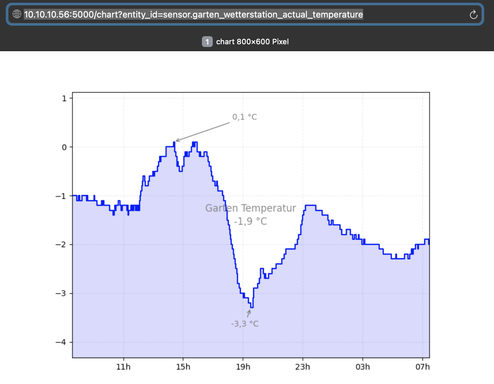
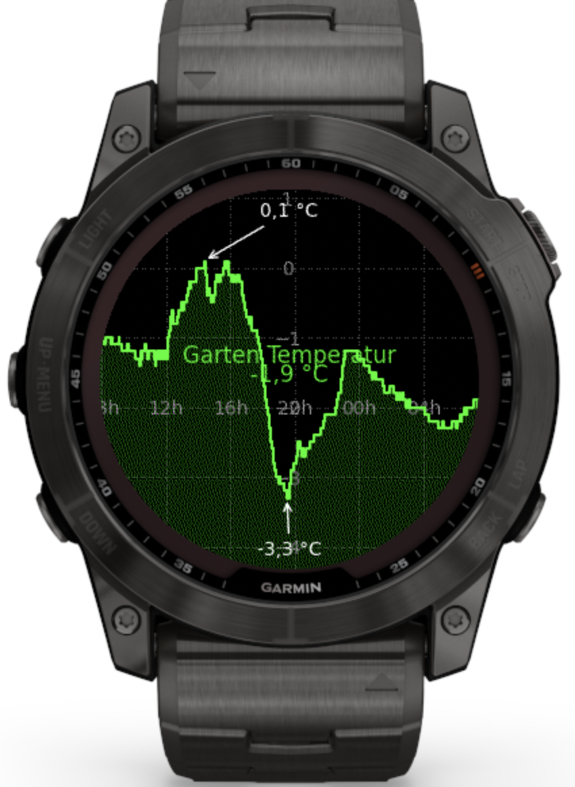

# Home Assistant Add-on: Bitmap Chart Server

![Project Maintenance][maintenance-shield]

A Home Assistant add-on that provides a chart visualization for sensor history data.

## About

This Home Assistant Add-on is an Bitmap-Server providing a chart of the history data of an entity. It allows you to visualize your sensor data in a customizable chart format, accessible through a web interface.

The main goal is to give special devices (Garmin Watches, ESP32-Projects, E-Ink Displays, SIP-Telephones, ...) the ability to display charts as simple images.

## Features

- Web-based chart visualization
- Support for any Home Assistant sensor entity
- Real-time data updates
- Configurable through the Home Assistant interface
- Secure access through Home Assistant authentication

## Installation

1. Navigate to the Home Assistant Add-on Store
2. Click the menu icon (⋮) in the top right corner and select "Repositories"
3. Add this repository URL: `https://github.com/ByteWolfGang/HomeAssistantAddOns`
4. The add-on should now appear in the add-on store
5. Click install and wait for the installation to complete

[maintenance-shield]: https://img.shields.io/maintenance/yes/2025.svg 